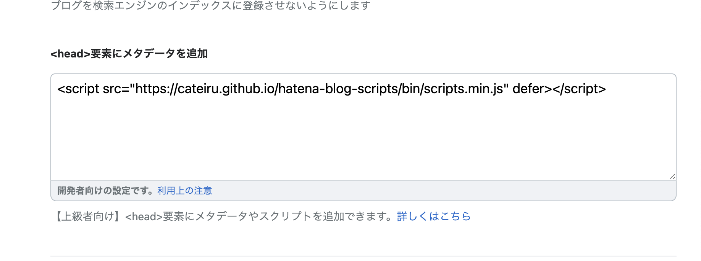

# はてなブログ Scripts

## 使い方

`管理ページ > 設定 > 詳細設定 > <head>要素にメタデータを追加`に以下を貼り付けてください。

```html
<script src="https://cateiru.github.io/hatena-blog-scripts/bin/scripts.min.js" defer></script>
```




## 機能

### 1. 見出しコピー

見出しをクリックすることでそのリンクをコピーできます。

https://user-images.githubusercontent.com/24271196/199141721-7a1b188a-91da-4042-9778-b57f91791f50.mov

[headingLink.ts](./src/headingLink.ts)

## LICENSE

[MIT](./LICENSE)
